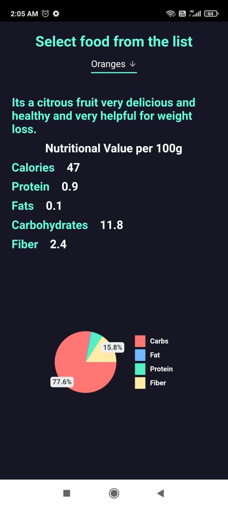
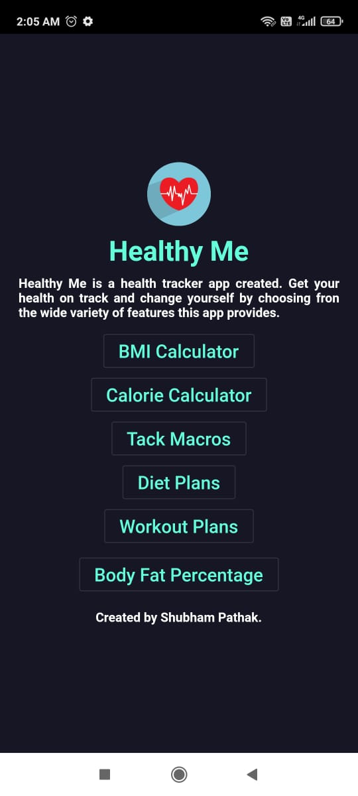
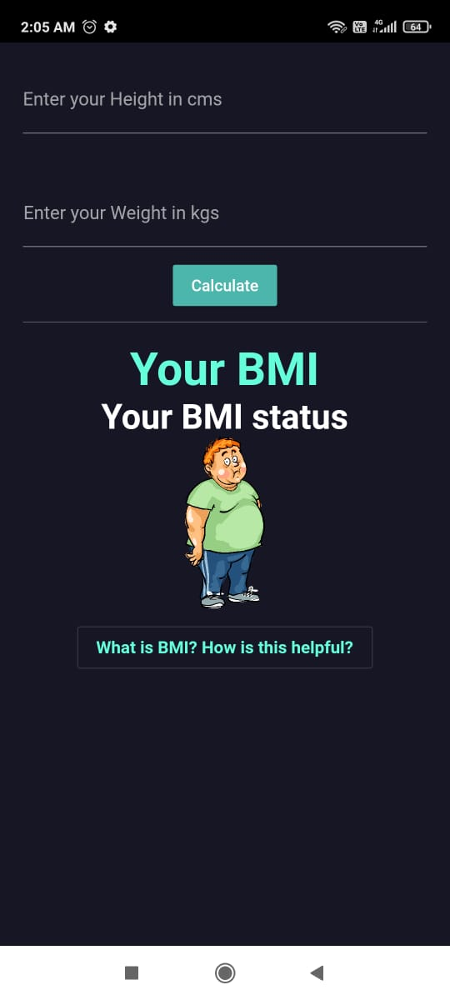
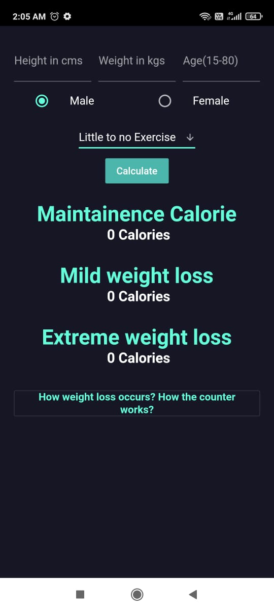

# Healthy Me App

Healthy Me app is an my first attempt to make a complete flutter app with rest api's integration along with beautiful UI. App has features like BMI Calculator, Calorie tracker, Maintenance calorie calculator, Diet plans.

## Features
- BMI Calculator.
- Calorie counter
- Calorie tracker for various foods
- Diet plans
- Integrates with a REST API made in NodeJs and MongoDB

##  APP Link
https://drive.google.com/file/d/1qbXixSOfPgE3KC81kY3uE26aOIDM_kOZ/view?usp=sharing

##  Screen Shots

